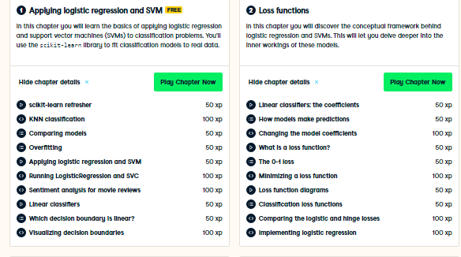

# Curso-Linear-Classifiers-in-Python-de-Datacamp
Curso Linear Classifiers in Python 

**Linear Classifiers in Python**

Link de acceso al curso:  

https://www.datacamp.com/courses/linear-classifiers-in-python

## Descripción del curso:

En este curso, aprenderá todo sobre el uso de clasificadores lineales, específicamente Logistic regression y Support Vector Machine, con scikit-learn. Una vez que haya aprendido a aplicar estos métodos, se sumergirá en las ideas detrás de ellos y descubrirá qué es lo que realmente los motiva. Al final de este curso, sabrá cómo train, test y ajustar estos clasificadores lineales en Python. También tendrá una base conceptual para comprender muchos otros algoritmos de aprendizaje automático.

## Contenido del curso:

